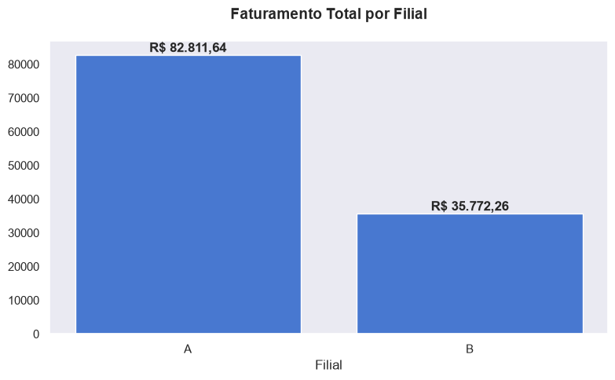
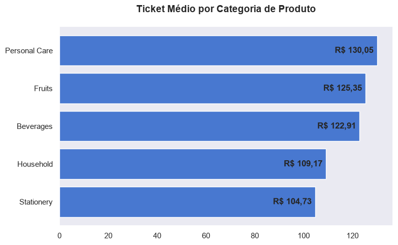

# Análise de Vendas de Supermercado

Projeto de análise exploratória de dados desenvolvido em Python para investigar o comportamento das vendas de um supermercado fictício, comparando tipos de clientes, desempenho das filiais e categorias de produtos.

## Objetivo

Responder às seguintes perguntas de negócio:

- Clientes `Member` gastam mais do que clientes `Normal`?
- Existe diferença de desempenho entre as filiais?
- Quais categorias possuem maior participação no faturamento?
- Quais fatores ajudam a explicar o desempenho superior de uma filial?

## Base de dados

A base possui **1.000 registros** e **12 colunas**, sem valores ausentes ou registros duplicados.

Principais variáveis:

- `branch`: filial da venda;
- `customer_type`: tipo de cliente (`Member` ou `Normal`);
- `product_category`: categoria do produto;
- `unit_price`: preço unitário;
- `quantity`: quantidade vendida;
- `total_price`: valor total da venda;
- `reward_points`: pontos de recompensa.

> A base representa dados fictícios e foi utilizada exclusivamente para fins educacionais.

## Tecnologias utilizadas

- Python
- Pandas
- Matplotlib
- Seaborn
- Jupyter Notebook

## Etapas da análise

1. Importação e inspeção inicial dos dados;
2. Verificação de valores ausentes e duplicados;
3. Análise dos tipos de clientes;
4. Comparação do faturamento, volume de vendas e ticket médio das filiais;
5. Análise de faturamento e ticket médio por categoria;
6. Construção de um ranking executivo das filiais;
7. Síntese dos principais resultados.

## Principais resultados

- A filial **A** concentrou **67,4% das vendas** e aproximadamente **69,8% do faturamento**.
- O ticket médio da filial A foi de aproximadamente **R$122,87**, superior ao da filial B, de aproximadamente **R$109,73**.
- Clientes `Member` representaram **51,6% das transações** e apresentaram ticket médio aproximadamente **R$8,11 maior** que clientes `Normal`.
- **Personal Care** foi a categoria com maior faturamento e maior ticket médio.
- **Fruits** apresentou o maior volume de itens vendidos.
- A filial A liderou o faturamento em todas as categorias analisadas.

## Visualizações

### Faturamento por filial



### Ticket médio por categoria



## Conclusão

O desempenho superior da filial A está associado à combinação de maior volume de vendas, maior ticket médio e melhor desempenho nas categorias de maior faturamento. Os clientes `Member` também se mostraram relevantes para a receita, apresentando maior valor médio por compra.

Como os dados são observacionais e fictícios, os resultados indicam associações e padrões, não relações causais.

## Estrutura do repositório

```text
supermarket-sales-analysis/
├── assets/
│   ├── faturamento_filial.png
│   └── ticket_medio_categoria.png
├── data/
│   └── sales.csv
├── .gitignore
├── README.md
├── requirements.txt
└── supermarket_sales_analysis.ipynb
```

## Como executar

1. Clone ou baixe este repositório.
2. Instale as dependências:

```bash
pip install -r requirements.txt
```

3. Abra o arquivo `supermarket_sales_analysis.ipynb` no VS Code ou Jupyter Notebook.
4. Execute as células na ordem apresentada.

## Autor

Projeto desenvolvido por **Rômison Carvalho** como parte dos estudos de Python e Análise de Dados.
